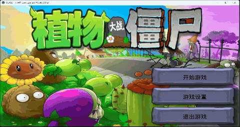
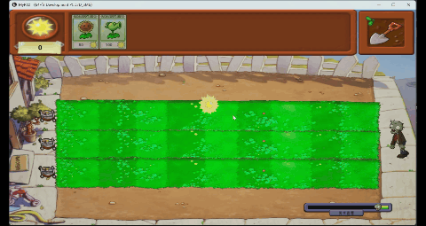
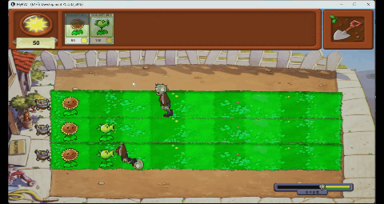
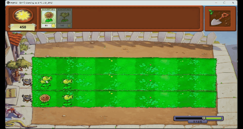
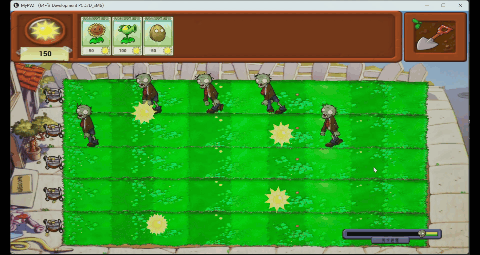
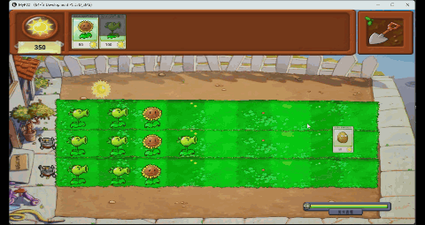
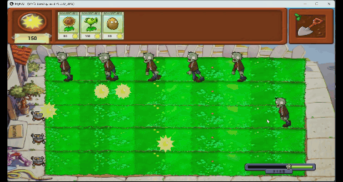

# UE5 复刻《植物大战僵尸》| 植物大战僵尸 (UE5 PVZ Clone)

这是一个基于 **Unreal Engine 5** 独立完成的《植物大战僵尸》核心玩法复刻项目。该项目旨在通过完整的游戏闭环实践，展示我对 UE5 游戏开发、系统架构的掌握能力。

## 项目亮点

- **完整玩法闭环**：独立实现了从阳光收集、植物种植/铲除、僵尸生成到胜负判定的全部核心玩法。
- **数据驱动架构**：使用 UE5 **DataTable** 统一管理植物、僵尸和关卡属性，实现数据与逻辑的解耦，易于扩展。
- **复杂状态管理**：通过**状态机模式**处理鼠标交互（种植/铲除状态切换），确保操作逻辑清晰且手感良好。
- **系统整合**：集成了动画蒙太奇、音效播放、UMG UI 及存档系统，构建了完整的游戏体验。

## 游戏预览

| 关卡选择与设置 | 阳光收集与种植 | 僵尸生成与攻击 | 植物铲除 |
| :---: | :---: | :---: | :---: |
|  |  |  |  |

| 割草机 | 胜利结算 | 失败结算 |
| :---: | :---: | :---: |
|  |  |  |

**演示视频**：(https://www.bilibili.com/video/BV1zyAzziEm7?vd_source=84db85feb1b2a05e5e57326727ea8e86)

## 核心功能

- **植物系统**：实现了向日葵（生产阳光）、豌豆射手（攻击）、坚果墙（防御）3 种植物。
- **僵尸系统**：实现了基础僵尸，具有移动、攻击、死亡等 AI 行为。
- **交互系统**：
  - 鼠标选择卡片，点击进入种植模式。
  - 种植模式下，鼠标移动到可种植格子上显示预览。
  - 鼠标点击铲子进入铲除模式。
  - 鼠标点击空区域取消种植/铲除模式。
- **经济系统**：阳光的收集、消耗与实时 UI 更新。
- **存档系统**：支持保存关卡进度和解锁的植物。
- **关卡流程**：包含开始、战斗、胜利/失败、结算的完整流程控制。

## 技术栈

- **引擎**：Unreal Engine 5.4
- **核心机制**：
  - **DataTable**：植物/僵尸/关卡的静态数据配置。
  - **状态机 (State Machine)**：管理玩家交互状态 (Idle, Planting, Shoveling)。
  - **行为树 (Behavior Tree)**：控制僵尸的简单 AI。
  - **UMG**：实现所有用户界面。
  - **GameInstance/Subsystem**：管理跨关卡数据和存档逻辑。
- **版本控制**：Git

## 项目结构
```
Content/
├── Map/             # 关卡相关资源（地图、数据等）
├── Plant/           # 植物相关资源（蓝图、模型等）
├── Player/          # 玩家相关资源
├── Res/             # 资源文件（模型、材质、贴图等）
├── Sound/           # 音效文件
├── UI/              # UI 相关资源
└── Zombie/          # 僵尸相关资源
```

## 游戏运行

### 环境要求
- Windows 10/11
- Unreal Engine 5.4 或更高版本

### 运行步骤
1. **克隆仓库**
   ```bash
   git clone https://github.com/Hapusny/PVZ.git

2. **打开项目**

- 双击 PVZ.uproject 打开项目。

3. **运行**

- 点击 UE5 编辑器中的 Play 按钮开始游戏。


